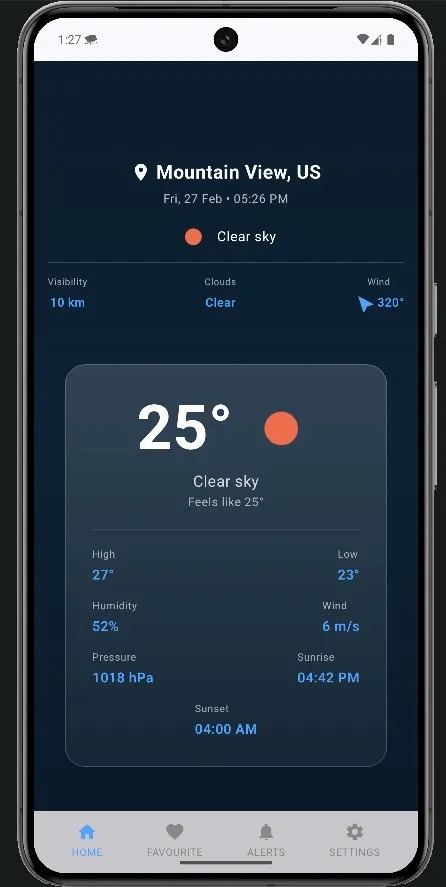
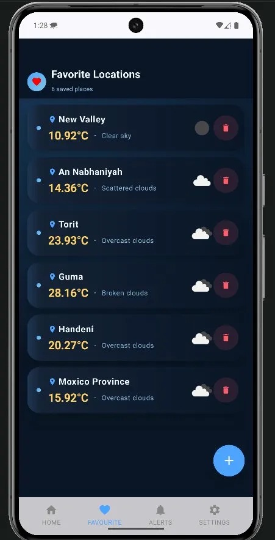
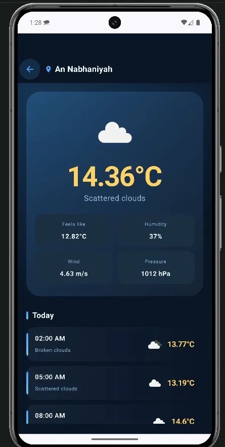
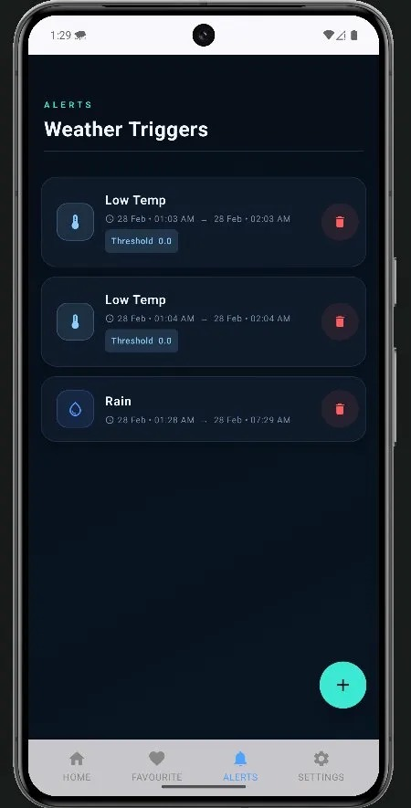
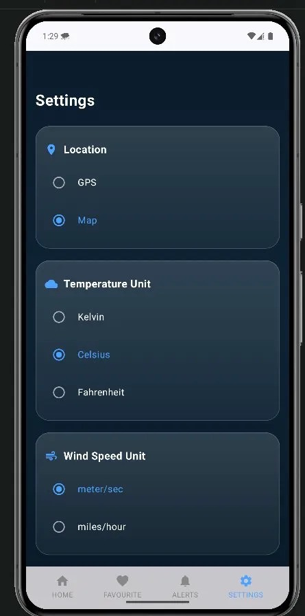
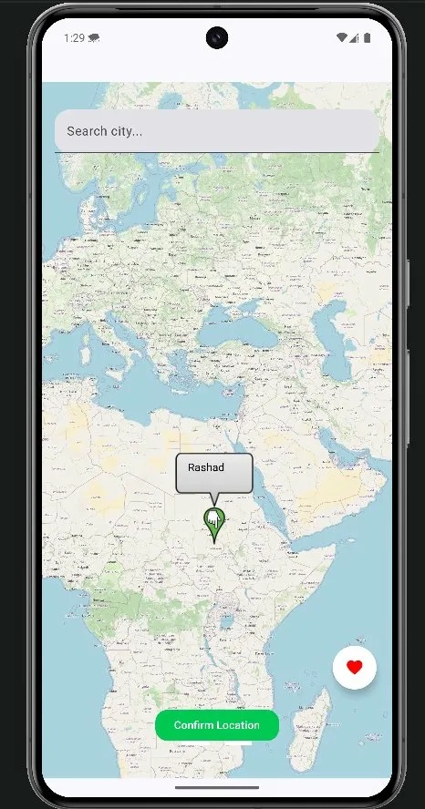
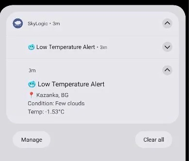

# 🌤️ SkyLogic — Weather App

<p align="center">
  
  
  
  
</p>

<p align="center">
  A clean, modern Android weather app built with Jetpack Compose that delivers real-time forecasts, smart alerts, and offline support — all wrapped in a beautiful dynamic UI.
</p>

---

## 📸 Screenshots

<p align="center">
  
  
  
  
  
</p>

<p align="center">
  
  
</p>

---

## ✨ Features

### 🏠 Home — Current Weather

- Requests GPS permission on first launch to detect your current location
- Displays full weather details: temperature, feels like, high/low, humidity, wind speed, pressure, sunrise & sunset
- **3-hourly forecast** for the current day
- **5-day forecast** with daily summaries
- Dynamic background gradient that changes based on weather condition
- **Offline mode**: shows last cached data with a red banner indicating no internet connection

### ❤️ Favourite Locations

- View all your saved locations in one list
- Each card shows: city name, current temperature, weather condition, and a weather icon
- Counter in the header shows how many places you've saved
- Tap any location to view its **full weather details** (same as the home screen)
- Offline banner appears here too when there's no internet
- **Floating Action Button** takes you directly to the Map screen to add new locations

### 🗺️ Map Selection

- Interactive map powered by OpenStreetMap
- **Search by city name** or navigate the map manually
- Tap anywhere on the map to drop a pin and get the location name
- **Add to Favourites** button (❤️) to save the selected location
- **Confirm Location** button to set the selected location as your home weather screen

### 🔔 Alerts — Weather Triggers

- View all your active weather alerts in a list
- Each alert card shows:
  - Condition type (Rain 🌧, Snow ❄️, Wind 🌬, High Temp 🌡, Low Temp 🥶)
  - Active time window (start → end)
  - Threshold value (for temperature and wind alerts)
- Alerts are checked automatically **every 15 minutes** in the background using WorkManager
- Two alert types:
  - **Notification** — clickable push notification that takes you to the Alerts screen
  - **Alarm** — full-screen alarm activity with sound, visible even on the lock screen
- Tap **+** to create a new alert

### ⚙️ Settings

| Setting             | Options                               |
| ------------------- | ------------------------------------- |
| 📍 Location Source  | GPS (auto-detect) / Map (manual pick) |
| 🌡️ Temperature Unit | Celsius / Kelvin / Fahrenheit         |
| 💨 Wind Speed Unit  | meter/sec / miles/hour                |
| 🌐 Language         | English / Arabic (full RTL support)   |
| 🔔 Notifications    | Allow / Deny                          |

---

## 🏗️ Architecture & Tech Stack

| Layer            | Technology                                 |
| ---------------- | ------------------------------------------ |
| UI               | Jetpack Compose                            |
| Architecture     | MVVM + Repository Pattern                  |
| Local DB         | Room Database                              |
| Background Tasks | WorkManager (PeriodicWork every 15 min)    |
| Preferences      | DataStore Preferences                      |
| Networking       | Retrofit + OkHttp                          |
| Map              | OpenStreetMap (OSMDroid)                   |
| Async            | Kotlin Coroutines + Flow                   |
| DI               | Manual Dependency Injection                |
| Testing          | JUnit4 · Turbine · MockK · Coroutines Test |

---

## 🧪 Testing

The project has full unit test coverage across all layers:

```
✅ LocalDataSource   — Room in-memory database tests
✅ AppRepository     — FakeLocalDataSource + FakeRemoteDataSource
✅ WeatherViewModel  — 8 test cases covering all UI states
✅ SettingsViewModel — 12 test cases for all settings operations
```

Tests follow the **Fake pattern** (no Mockito) using injected interfaces for clean, readable, and maintainable test code.

---

## 🚀 Getting Started

### Prerequisites

- Android Studio Hedgehog or later
- Android SDK 26+
- OpenWeatherMap API key

### Installation

```bash
# Clone the repository
git clone https://github.com/MohamedAliShaltoot/ITI_Kotlin_SkyLogic_App.git

# Open in Android Studio
# File → Open → select the cloned folder
```

### API Key Setup

1. Get a free API key from [OpenWeatherMap](https://openweathermap.org/api)
2. Open `RetrofitInstance.kt`
3. Replace the API key:

```kotlin
const val API_KEY = "your_api_key_here"
```

### Build & Run

```bash
# Run on connected device or emulator
./gradlew installDebug
```

---

## 📁 Project Structure

```
app/
├── data/
│   ├── local/          # Room DB, DAOs, Entities
│   ├── remote/         # Retrofit, WeatherService
│   └── repository/     # AppRepository, IAppRepository
├── models/             # Data classes (Weather, Forecast, etc.)
├── view/
│   ├── alertsView/     # Alert screen + WeatherAlertWorker
│   ├── favouriteView/  # Favourites list + details
│   ├── mapSelectionView/
│   ├── settingView/    # Settings screen + SettingsDataStore
│   └── weatherView/    # Home weather screen
└── utils/              # LocationHelper, GlassCard, etc.
```

---

## 📋 Permissions

```xml
<uses-permission android:name="android.permission.ACCESS_FINE_LOCATION"/>
<uses-permission android:name="android.permission.ACCESS_COARSE_LOCATION"/>
<uses-permission android:name="android.permission.INTERNET"/>
<uses-permission android:name="android.permission.POST_NOTIFICATIONS"/>
<uses-permission android:name="android.permission.SCHEDULE_EXACT_ALARM"/>
<uses-permission android:name="android.permission.RECEIVE_BOOT_COMPLETED"/>
```

---

## 🔗 Repository

📦 [GitHub — SkyLogic](https://github.com/MohamedAliShaltoot/ITI_Kotlin_SkyLogic_App)

```bash
git clone https://github.com/MohamedAliShaltoot/ITI_Kotlin_SkyLogic_App.git
```

---

## 👨‍💻 Author

**Mohamed Ali Shaltoot**

- GitHub: [@MohamedAliShaltoot](https://github.com/MohamedAliShaltoot)

---

<p align="center">Built with ❤️ using Kotlin & Jetpack Compose</p>
